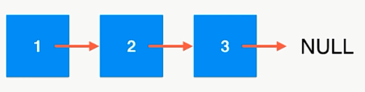
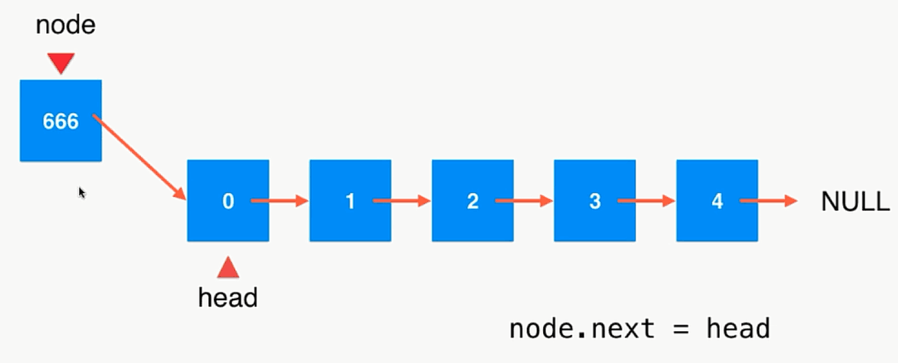
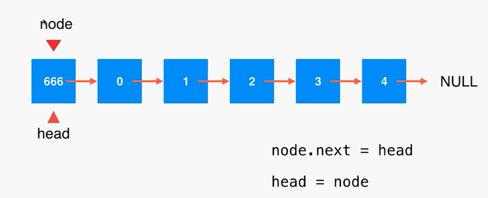
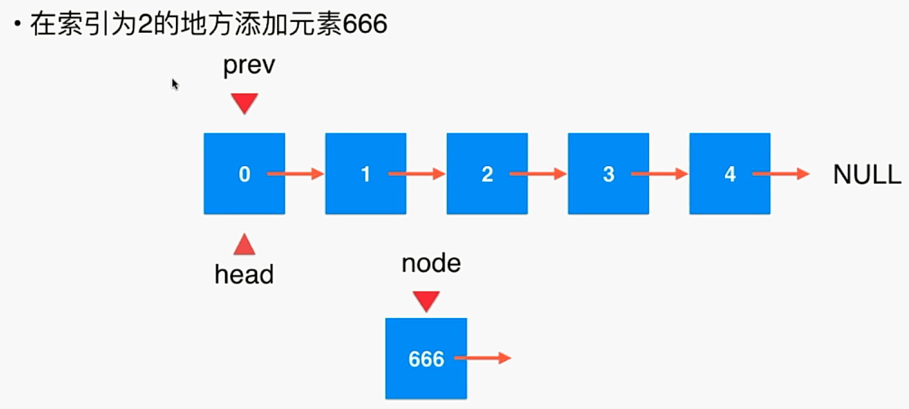
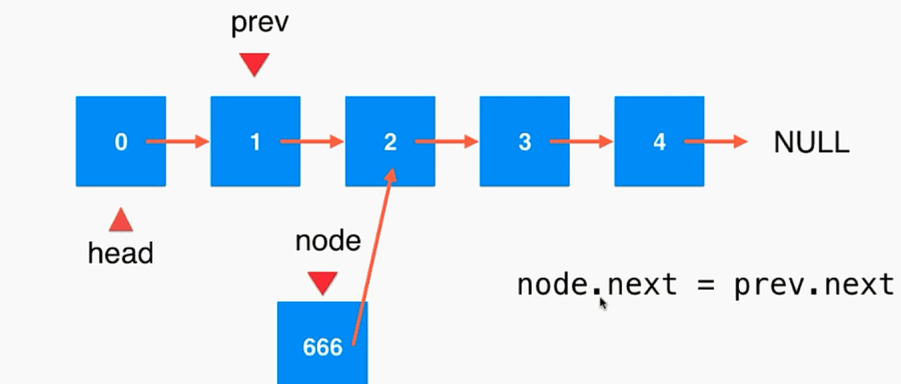
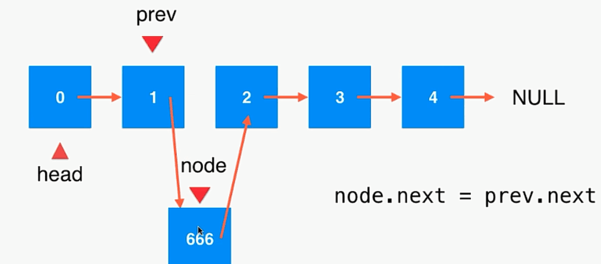
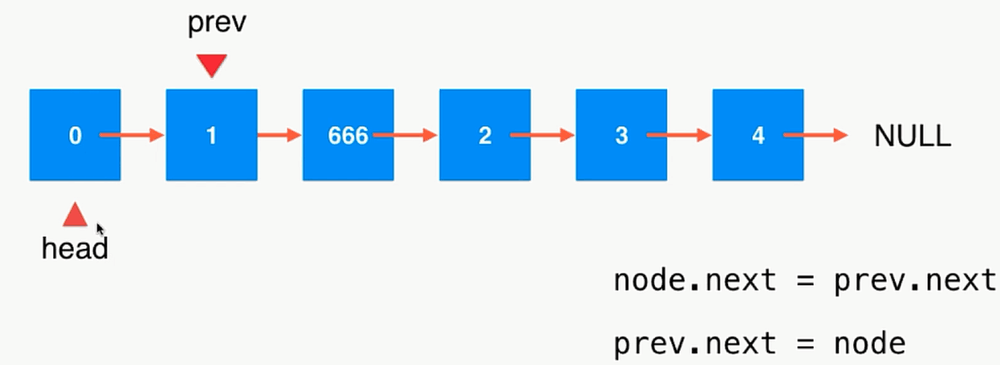
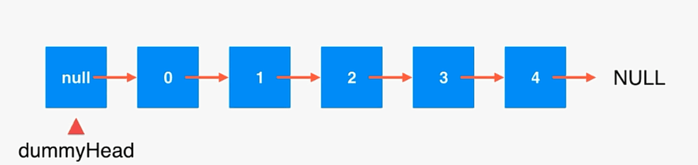
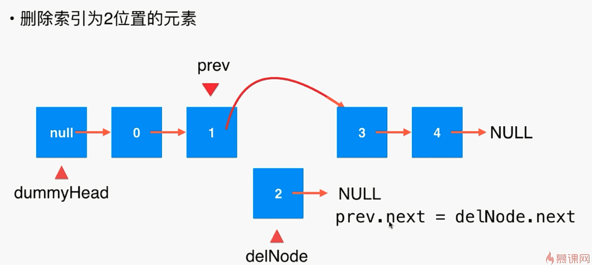
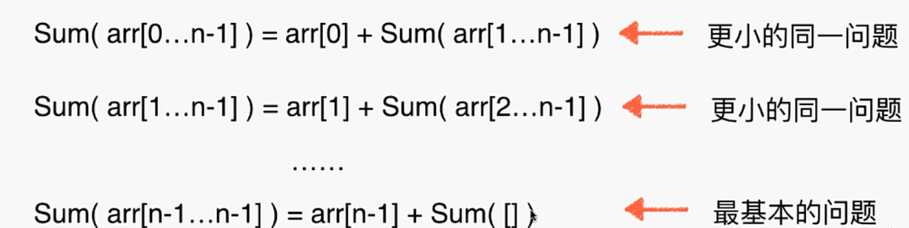

- 1 数据存储在节点中 
```java
class Node{
    E e;
    Node next;
}
```
链表是一种真正的动态的数据结构，不需要处理固定的容量的问题。
但是链表丧失了随机访问数据的能力。



- 2 在链表中添加元素图示：




- 3、在链表指定索引位置添加元素







- 4、为链表的设立虚拟的头结点
我们在写链表添加元素的时候有一个逻辑并不够优雅，在头部添加元素需要单独做一些处理。
是因为，头部节点前面没有任何的节点，prev 这个技巧用不到

- 5、链表的删除操作



- 6、递归：
递归 本质上讲，递归就是将原来的问题，转化为 更小的同一个问题

举例：数组求和：



